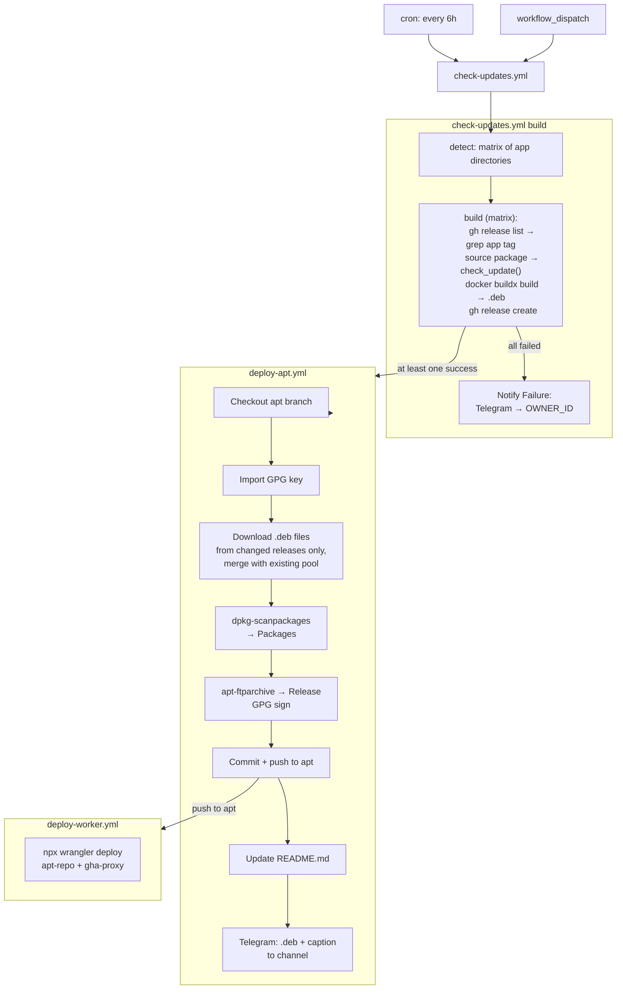
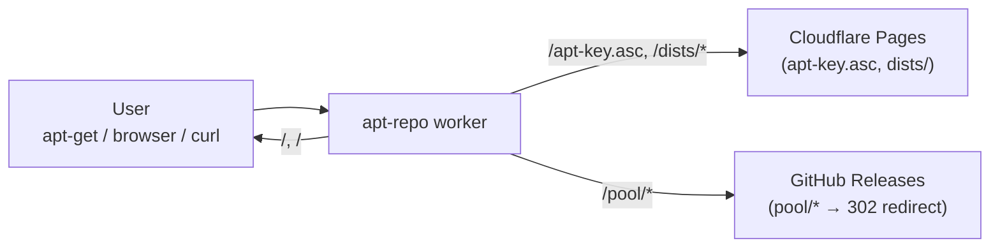
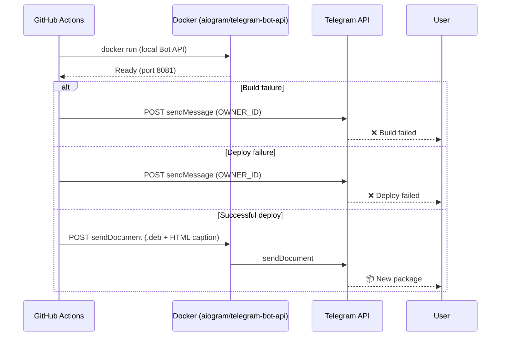
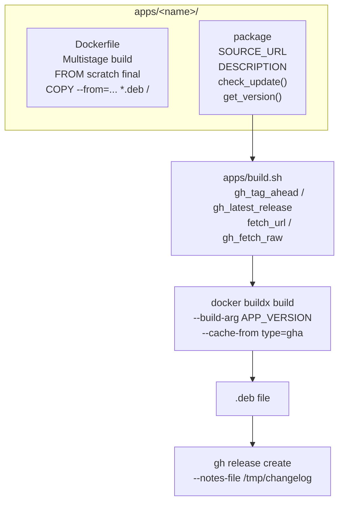
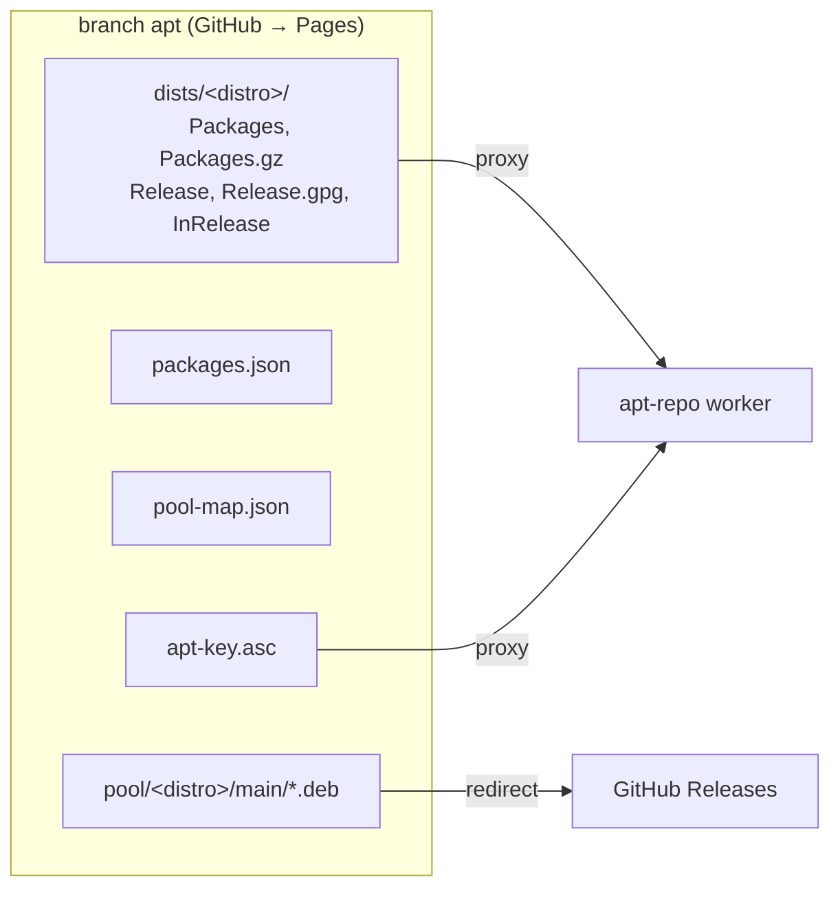

# Architecture

Personal APT repository for Ubuntu/Debian packages unavailable or outdated in standard repos.

## Branches

The project uses three isolated branches. No file crosses branch boundaries:

| Branch | Purpose |
|--------|---------|
| `apps` | Package definitions (`apps/*/`), CI/CD (`check-updates.yml`, `deploy-apt.yml`), documentation (`docs/`) |
| `worker` | Cloudflare Workers (`workers/apt-repo/`, `workers/gha-proxy/`) + `deploy-worker.yml` |
| `apt` | APT repository data (`dists/`, `pool/`, `Packages`, `Release`, `packages.json`) |

---

## CI/CD Pipeline

---

## Cloudflare Workers (branch `worker`)

### apt-repo

Frontend serving APT repository files.

Configurable via env vars: `REPO`, `PAGES_ORIGIN`, `CACHE_BUST`, `SITE_NAME`, `AUTHOR`, `TELEGRAM`

### gha-proxy

HTTP proxy for CI, deployed as a Cloudflare Worker. Provides a fallback path for `fetch_url()` in `apps/build.sh` when direct outbound requests from GitHub Actions runners fail (network restrictions, API blocks, etc.).

**Flow:**
1. `fetch_url(url)` tries direct `curl` with connect timeout of 10s
2. If that fails and `PROXY_URL`/`PROXY_TOKEN` are set, it URL-encodes the target URL and sends a GET to `PROXY_URL?url=<encoded>` with `X-Proxy-Token` header
3. The worker validates the token (403 if mismatch), rejects non-HTTPS targets (400), and forwards the request stripping the auth header
4. The response body is returned back to the caller

**Secrets** (`check-updates.yml`, `deploy-apt.yml`):
- `PROXY_URL` — worker endpoint
- `PROXY_TOKEN` — shared token for `X-Proxy-Token`

Any package whose `check_update()` or `get_version()` fetches from external APIs uses `fetch_url()` and thus benefits from the fallback.

---

## Telegram notifications

---

## Package build system

### package functions

| Function | Purpose |
|----------|---------|
| `check_update()` | Checks if an update is available (exit 0 = yes) |
| `get_version()` | Outputs changelog to stdout, sets `$version` |
| `SOURCE_URL` | Project URL |
| `DESCRIPTION` | Package description |

Template for a new package: [`docs/template/`](template/).

### Helpers (in `apps/build.sh`)

| Function | Purpose |
|----------|---------|
| `fetch_url <url>` | HTTP request (curl → gha-proxy fallback) |
| `gh_fetch_raw <repo> <path>` | Fetch file from GitHub via API |
| `gh_tag_ahead <repo>` | Tag + commits ahead |
| `gh_latest_release <repo>` | Latest release |
| `gh_release_body[_by_tag]` | Release changelog |
| `pull_package_info` | Log header |

---

## APT repository structure (branch `apt`)

